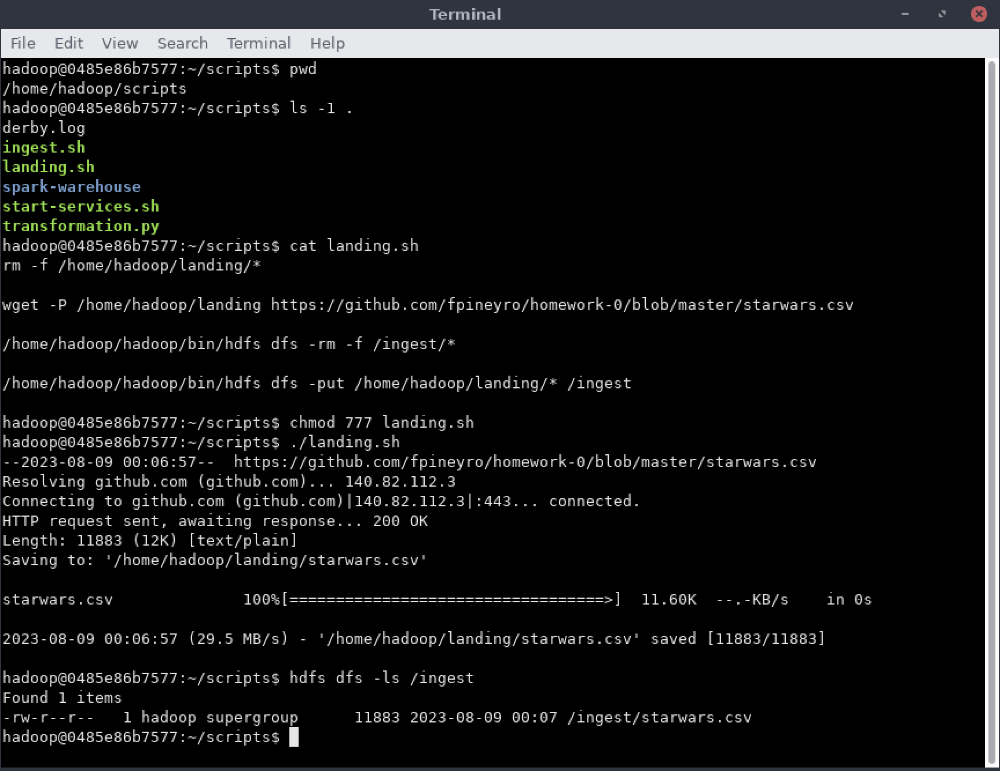

Hadoop Commands
===============

**Listar archivos**

```
hdfs dfs -ls /
```

**Remover archivos**

```
hdfs dfs -rm -f /ingest/*
```

**Remover un directorio**

```
hdfs dfs -rm -r <DIRECTORY>
```

**Mover archivos al FileSystem**

```
hdfs dfs -put /home/hadoop/landing/* /ingest
```

**Crear carpeta en el FileSytem**

```
hdfs dfs -mkdir /nifi
```

**Crear carpeta persisos a carpeta**

```
hdfs dfs -chmod 777 /nifi
```

Practica
========

1. Ingresar a la vm, luego ir a la carpeta "data engineer" y a `consola_hadoop`. Luego seleccionar Run.
2. Ingresar al directorio `/home/hadoop/scripts`.
3. Crear un script llamado `landing.sh` que baje el archivo `https://github.com/fpineyro/homework-0/blob/master/starwars.csv` al directorio temporal `/home/hadoop/landing` y luego lo envíe al directorio de Hadoop file system (HDFS) `/ingest`. Antes de finalizar el script que borre el archivo `starwars.csv` del directorio temporal `/home/hadoop/landing`
4. Cambiar permisos para que el script pueda ser ejecutado
5. Ejecutar el script para que baje el archivo `starwars.csv` de Github y lo envíe al directorio `/ingest` de HDFS
6. Verificar que el archivo se encuentre en el directorio `/ingest` de HDFS.

Imagenes:


