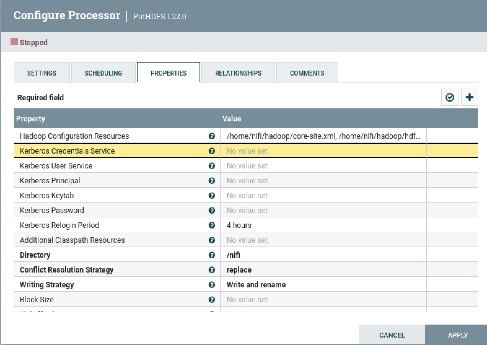
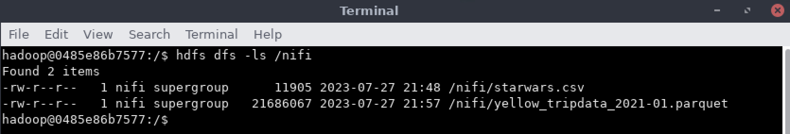
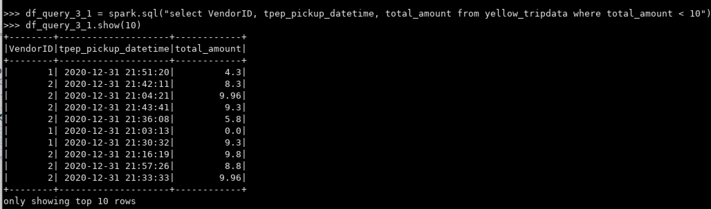

Clase 05 - Transformacion SQL
=============================

### Ejercicio 1

En el container de Nifi, crear un `.sh` que permita descargar el archivo de `https://data-engineer-edvai.s3.amazonaws.com/yellow_tripdata_2021-01.parquet` y lo guarde en `/home/nifi/ingest`. Ejecutarlo.


### Ejercicio 2

Por medio de la interfaz gráfica de Nifi, crear un job que tenga dos procesos:
A. GetFile para obtener el archivo del punto 1 (`/home/nifi/ingest`)
B. putHDFS para ingestarlo a HDFS (directorio nifi)






### Ejercicio 3

Con el archivo ya ingestado en HDFS/nifi, escribir las consultas y agregar captura de pantalla del resultado. Para los ejercicios puedes usar SQL mediante la creación de una vista llamada `yellow_tripdata`.
También debes chequear el diccionario de datos por cualquier duda que tengas respecto a las columnas del archivo `https://www.nyc.gov/assets/tlc/downloads/pdf/data_dictionary_trip_records_yellow.pdf`


### Ejercicio 3.0

Leer archivo `.parquet` y crear vista `yellow_tripdata`.

```python
df = spark.read.parquet("hdfs://172.17.0.2:9000/nifi/yellow_tripdata_2021-01.parquet")
df.createOrReplaceTempView("yellow_tripdata")
```


### Ejercicio 3.1

Mostrar los resultados siguientes
A. VendorId Integer
B. Tpep_pickup_datetime date
C. Total_amount double
D. Donde el total (total_amount sea menor a 10 dólares)

```python
df_query_3_1 = spark.sql("select VendorID, tpep_pickup_datetime, total_amount from yellow_tripdata where total_amount < 10")
df_query_3_1.show(10)
```



### Ejercicio 3.2

Mostrar los 10 días que más se recaudó dinero (tpep_pickup_datetime, total amount).

```python
df_query_3_2 = spark.sql("select date(tpep_pickup_datetime) as tpep_pickup_datetime, sum(total_amount) from yellow_tripdata group by date(tpep_pickup_datetime) order by 2 desc limit 10")
df_query_3_2.show(10)
```


### Ejercicio 3.3

Mostrar los 10 viajes que menos dinero recaudó en viajes mayores a 10 millas (trip_distance, total_amount).

```python
df_query_3_3 = spark.sql("select trip_distance, total_amount as total from yellow_tripdata where trip_distance > 10 order by 2 asc limit 10")
df_query_3_3.show(10)
```


### Ejercicio 3.4

Mostrar los viajes de más de dos pasajeros que hayan pagado con tarjeta de crédito (mostrar solo las columnas trip_distance y tpep_pickup_datetime).

```python
df_query_3_4 = spark.sql("select trip_distance, date(tpep_pickup_datetime) as tpep_pickup_datetime from yellow_tripdata where passenger_count > 2 and payment_type = 1")
df_query_3_4.show(10)
```


### Ejercicio 3.5

Mostrar los 7 viajes con mayor propina en distancias mayores a 10 millas (mostrar campos tpep_pickup_datetime, trip_distance, passenger_count, tip_amount).

```python
df_query_3_5 = spark.sql("select trip_distance, date(tpep_pickup_datetime) as tpep_pickup_datetime, cast(passenger_count as int), tip_amount from yellow_tripdata where trip_distance > 10 order by 4 desc limit 7")
df_query_3_5.show(10)
```


### Ejercicio 3.6

Mostrar para cada uno de los valores de RateCodeID, el monto total y el monto promedio. Excluir los viajes en donde RateCodeID es 'Group Ride'.

```python
df_query_3_6 = spark.sql("select RatecodeID, sum(total_amount), avg(total_amount) from yellow_tripdata where RatecodeID != 6 group by RatecodeID")
df_query_3_6.show(10)
```


