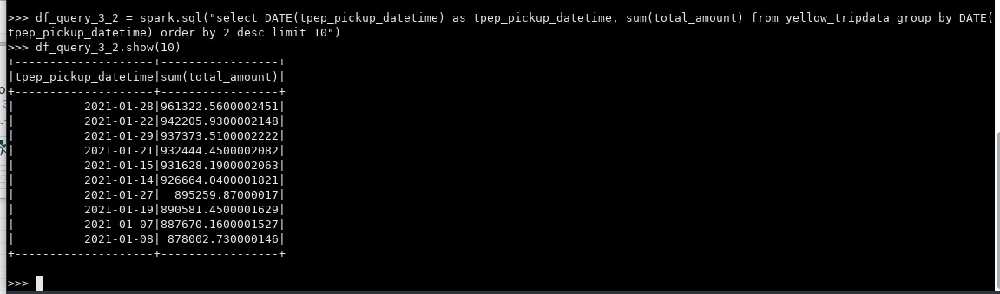

Docker Commands
===============

```
docker pull fedepineyro/edvai_postgres:v1
docker pull apache/nifi
docker image ls
docker run --name nifi -p 8443:8443 --dns=8.8.8.8 -d apache/nifi:latest
docker ps
docker logs nifi
docker logs nifi | grep Generated
docker cp /home/mferreyra/core-site.xml 9545ebf88fcd:/home/nifi/hadoop
docker cp /home/mferreyra/hdfs-site.xml 9545ebf88fcd:/home/nifi/hadoop
docker exec -it 9545ebf88fcd bash
docker ps
docker image ls
docker run --name edvai_postgres -e POSTGRES_PASSWORD=edvai -d -p 5432:5432 fedepineyro/edvai_postgres:v1
docker ps
docker inspect edvai_postgres
docker inspect edvai_hadoop
docker restart <container_id>
```

Comandos Sqoop
==============

**Listar databases:**
```
sqoop list-databases \
--connect jdbc:postgresql://172.17.0.4:5432/northwind \
--username postgres -P
```

**Listar tablas:**
```
sqoop list-tables \
--connect jdbc:postgresql://172.17.0.4:5432/northwind \
--username postgres -P
```

**Ejecutar queries:**
```
sqoop eval \
--connect jdbc:postgresql://172.17.0.4:5432/northwind \
--username postgres \
--P \
--query "select * from region limit 10"
```

**Importar tablas:**
```
sqoop import \
--connect jdbc:postgresql://172.17.0.4:5432/northwind \
--username postgres\
--P \
--table region\
--m 1 \
--target-dir /sqoop/ingest \
--as-parquetfile \
--delete-target-dir
```

**Importar tablas con filtro:**
```
sqoop import \
--connect jdbc:postgresql://172.17.0.4:5432/northwind \
--username postgres\
--P \
--table region\
--m 1 \
--target-dir /sqoop/ingest/southern \
--as-parquetfile \
--where "region_description = 'Southern'" \
--delete-target-dir
```

Clase 05 - Ejercicios Sqoop
===========================

### Ejercicio 1

Mostrar las tablas de la base de datos northwind.

```
sqoop list-databases \
--connect jdbc:postgresql://172.17.0.4:5432/northwind \
--username postgres -P
```

### Ejercicio 2

Mostrar los clientes de Argentina.

```
sqoop eval \
--connect jdbc:postgresql://172.17.0.4:5432/northwind \
--username postgres \
--P \
--query "select * from customers limit 10"
```

```
sqoop eval \
--connect jdbc:postgresql://172.17.0.4:5432/northwind \
--username postgres \
--P \
--query "select * from customers where country = 'Argentina' limit 10"
```

### Ejercicio 3

Importar un archivo `.parquet` que contenga toda la tabla orders. Luego ingestar el archivo a HDFS (carpeta `/sqoop/ingest`).

```
sqoop import \
--connect jdbc:postgresql://172.17.0.4:5432/northwind \
--username postgres \
--P \
--table orders \
--m 1 \
--target-dir /sqoop/ingest \
--as-parquetfile \
--delete-target-dir
```

### Ejercicio 4

Importar un archivo `.parquet` que contenga solo los productos con mas 20 unidades en stock, de la tabla Products. Luego ingestar el archivo a HDFS (carpeta `/sqoop/ingest`).

```
sqoop eval \
--connect jdbc:postgresql://172.17.0.4:5432/northwind \
--username postgres \
--P \
--query "select * from products where units_in_stock > 20 limit 10"
```

```
sqoop import \
--connect jdbc:postgresql://172.17.0.4:5432/northwind \
--username postgres \
--P \
--table products \
--m 1 \
--target-dir /sqoop/ingest/southern \
--as-parquetfile \
--where "units_in_stock > 20" \
--delete-target-dir
```

Clase 05 - Ejercicios Nifi
==========================

### Ejercicio 1

En el shell de Nifi, crear un script `.sh` que descargue el archivo starwars.csv al directorio `/home/nifi/ingest` (crearlo si es necesario).
Ejecutarlo con `./home/nifi/ingest/ingest.sh`

```
wget -P /home/nifi/ingest https://github.com/fpineyro/homework-0/blob/master/starwars.csv
```

### Ejercicio 2

Usando procesos en Nifi:

  1. Tomar el archivo `starwars.csv` desde el directorio `/home/nifi/ingest`.
  2. Mover el archivo `starwars.csv` desde el directorio anterior, a `/home/nifi/bucket` (crear el directorio si es necesario).
  3. Tomar nuevamente el archivo, ahora desde `/home/nifi/bucket`.
  4. Ingestarlo en HDFS/nifi (si es necesario, crear el directorio con `hdfs dfs -mkdir /nifi`)

Imagenes:



