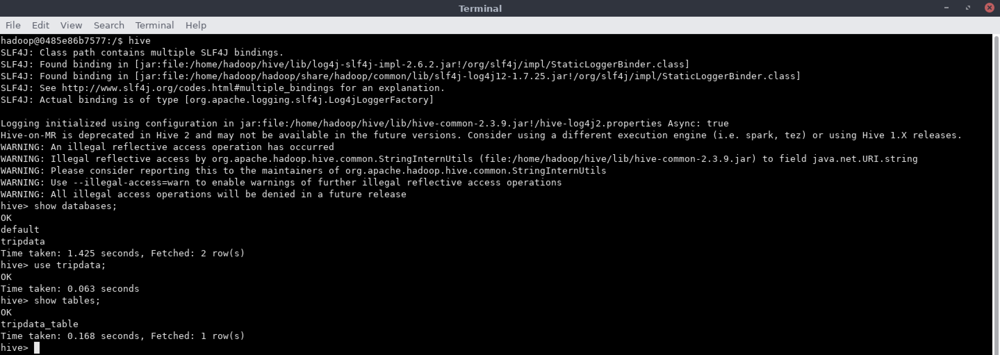
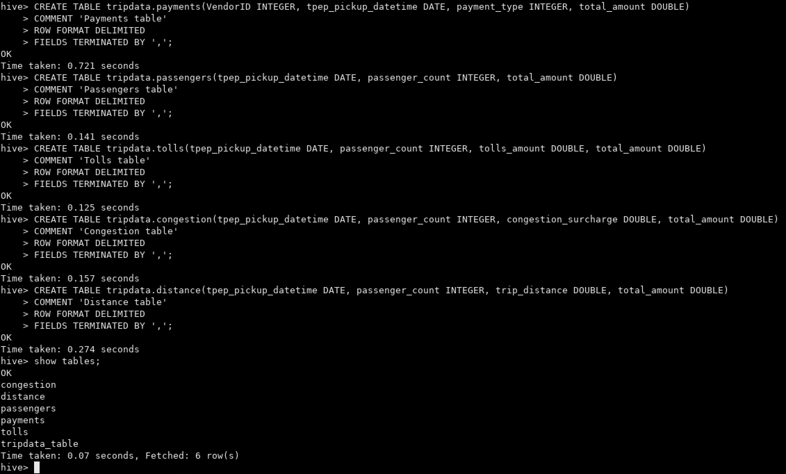
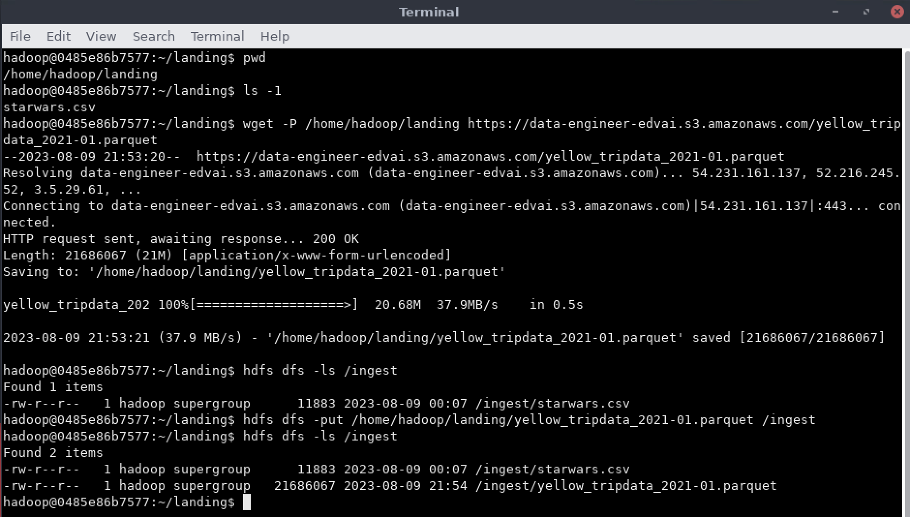
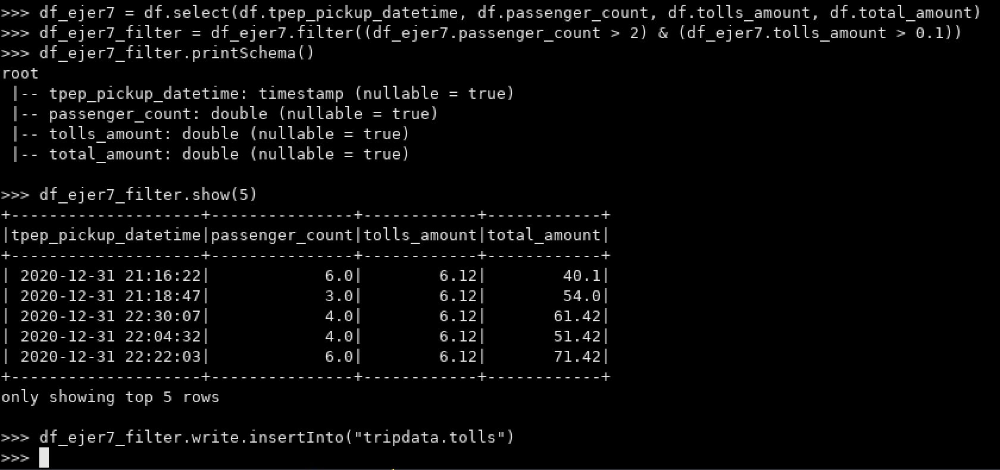

Clase 06 - PySpark Hive
=======================

Hive Commands
=============

**Listar base de datos**

```
show databases;
```

**Usar una base de datos**

```
use <database_name>;
```

**Listar tablas de una base de datos**

```
show tables;
```

**Describir una tabla de una base de datos**

```
describe <table_name>;
```

**Describir una tabla de una base de datos - Extended**

```
describe extended <table_name>;
```

**Describir una tabla de una base de datos - Formatted**

```
describe formatted <table_name>;
```

---

## Diccionario de datos:

https://www.nyc.gov/assets/tlc/downloads/pdf/data_dictionary_trip_records_yellow.pdf

---

### Ejercicio 1

En Hive, crear las siguientes tablas (internas) en la base de datos `tripdata` en hive:
A. `payments` (VendorID INTEGER, tpep_pickup_datetime DATE, payment_type INTEGER, total_amount DOUBLE)

```
CREATE TABLE tripdata.payments(VendorID INTEGER, tpep_pickup_datetime DATE, payment_type INTEGER, total_amount DOUBLE)
COMMENT 'Payments table'
ROW FORMAT DELIMITED
FIELDS TERMINATED BY ',';
```

B. `passengers` (tpep_pickup_datetime DATE, passenger_count INTEGER, total_amount DOUBLE)

```
CREATE TABLE tripdata.passengers(tpep_pickup_datetime DATE, passenger_count INTEGER, total_amount DOUBLE)
COMMENT 'Passengers table'
ROW FORMAT DELIMITED
FIELDS TERMINATED BY ',';
```

C. `tolls` (tpep_pickup_datetime DATE, passenger_count INTEGER, tolls_amount DOUBLE, total_amount DOUBLE)

```
CREATE TABLE tripdata.tolls(tpep_pickup_datetime DATE, passenger_count INTEGER, tolls_amount DOUBLE, total_amount DOUBLE)
COMMENT 'Tolls table'
ROW FORMAT DELIMITED
FIELDS TERMINATED BY ',';
```

D. `congestion` (tpep_pickup_datetime DATE, passenger_count INTEGER, congestion_surcharge DOUBLE, total_amount DOUBLE)

```
CREATE TABLE tripdata.congestion(tpep_pickup_datetime DATE, passenger_count INTEGER, congestion_surcharge DOUBLE, total_amount DOUBLE)
COMMENT 'Congestion table'
ROW FORMAT DELIMITED
FIELDS TERMINATED BY ',';
```

E. `distance` (tpep_pickup_datetime DATE, passenger_count INTEGER, trip_distance DOUBLE, total_amount DOUBLE)

```
CREATE TABLE tripdata.distance(tpep_pickup_datetime DATE, passenger_count INTEGER, trip_distance DOUBLE, total_amount DOUBLE)
COMMENT 'Distance table'
ROW FORMAT DELIMITED
FIELDS TERMINATED BY ',';
```





### Ejercicio 2

En Hive, hacer un `describe` de las tablas `passengers` y `distance`.

```
describe passengers;

describe distance;
```


### Ejercicio 3

Hacer ingest del file [yellow_tripdata_2021-01.csv](https://s3.amazonaws.com/nyc-tlc/trip+data/yellow_tripdata_2021-01.csv)

**NOTA**: Vamos a usar este file [yellow_tripdata_2021-01.parquet](https://data-engineer-edvai.s3.amazonaws.com/yellow_tripdata_2021-01.parquet) porque este [yellow_tripdata_2021-01.csv](https://s3.amazonaws.com/nyc-tlc/trip+data/yellow_tripdata_2021-01.csv) da error al descargarlo.

```bash
wget -P /home/hadoop/landing https://data-engineer-edvai.s3.amazonaws.com/yellow_tripdata_2021-01.parquet

hdfs dfs -put /home/hadoop/landing/yellow_tripdata_2021-01.parquet /ingest
```



---

Para los siguientes ejercicios, debes usar PySpark (obligatorio). Si deseas practicar más, también puedes repetir los mismos en SQL (opcional).

```python
df = spark.read.parquet("hdfs://172.17.0.2:9000/ingest/yellow_tripdata_2021-01.parquet")
```


### Ejercicio 4

(Opcional SQL) Generar una vista


### Ejercicio 5

Insertar en la tabla `payments` (VendorID, tpep_pickup_datetime, payment_type, total_amount) Solamente los pagos con tarjeta de crédito.

```python
df_ejer5 = df.select(df.VendorID, df.tpep_pickup_datetime, df.payment_type, df.total_amount)
df_ejer5_filter = df_ejer5.filter(df_ejer5.payment_type == 1)
df_ejer5_filter.printSchema()
df_ejer5_filter.show(5)
df_ejer5_filter.write.insertInto("tripdata.payments")
```


### Ejercicio 6

Insertar en la tabla `passengers` (tpep_pickup_datetime, passenger_count, total_amount) los registros cuya cantidad de pasajeros sea mayor a 2 y el total del viaje cueste más de 8 dólares.

```python
df_ejer6 = df.select(df.tpep_pickup_datetime, df.passenger_count, df.total_amount)
df_ejer6_filter = df_ejer6.filter((df_ejer6.passenger_count > 2) & (df_ejer6.total_amount > 8))
df_ejer6_filter.printSchema()
df_ejer6_filter.show(5)
df_ejer6_filter.write.insertInto("tripdata.passengers")
```


### Ejercicio 7

Insertar en la tabla `tolls` (tpep_pickup_datetime, passenger_count, tolls_amount, total_amount) los registros que tengan pago de peajes mayores a 0.1 y cantidad de pasajeros mayores a 1.

```python
df_ejer7 = df.select(df.tpep_pickup_datetime, df.passenger_count, df.tolls_amount, df.total_amount)
df_ejer7_filter = df_ejer7.filter((df_ejer7.passenger_count > 2) & (df_ejer7.tolls_amount > 0.1))
df_ejer7_filter.printSchema()
df_ejer7_filter.show(5)
df_ejer7_filter.write.insertInto("tripdata.tolls")
```




### Ejercicio 8

Insertar en la tabla `congestion` (tpep_pickup_datetime, passenger_count, congestion_surcharge, total_amount) los registros que hayan tenido congestión en los viajes en la fecha 2021-01-18.

```python
from pyspark.sql.functions import desc, asc, sum, to_date

df_ejer8 = df.select(df.tpep_pickup_datetime, df.passenger_count, df.congestion_surcharge, df.total_amount)
df_ejer8_filter = df_ejer8.filter((to_date(df_ejer8.tpep_pickup_datetime) == "2021-01-18") & (df_ejer8.congestion_surcharge > 0))
df_ejer8_filter.printSchema()
df_ejer8_filter.show(5)
df_ejer8_filter.write.insertInto("tripdata.congestion")
```


### Ejercicio 9

Insertar en la tabla `distance` (tpep_pickup_datetime, passenger_count, trip_distance, total_amount) los registros de la fecha 2020-12-31 que hayan tenido solamente un pasajero (passenger_count = 1) y hayan recorrido más de 15 millas (trip_distance).

```python
from pyspark.sql.functions import desc, asc, sum, to_date

df_ejer9 = df.select(df.tpep_pickup_datetime, df.passenger_count, df.trip_distance, df.total_amount)
df_ejer9_filter = df_ejer9.filter((to_date(df_ejer9.tpep_pickup_datetime) == "2020-12-31") & (df_ejer9.passenger_count == 1) & (df_ejer9.trip_distance > 15))
df_ejer9_filter.printSchema()
df_ejer9_filter.show(5)
df_ejer9_filter.write.insertInto("tripdata.distance")
```


