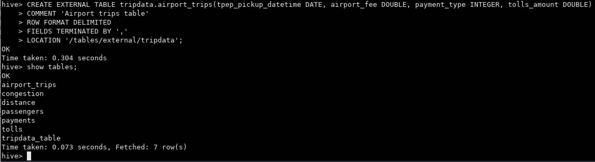
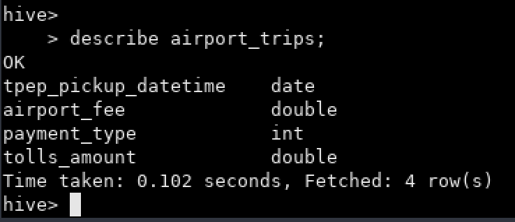

Clase 07 - Airflow
==================

## Diccionario de datos:

https://www.nyc.gov/assets/tlc/downloads/pdf/data_dictionary_trip_records_yellow.pdf

---

### Ejercicio 1

En Hive, crear la siguiente tabla (externa) en la base de datos `tripdata`:
A. `airport_trips` (tpep_pickup_datetime DATE, airport_fee DOUBLE, payment_type INTEGER, tolls_amount DOUBLE, total_amount DOUBLE)

```
CREATE EXTERNAL TABLE tripdata.airport_trips(tpep_pickup_datetime DATE, airport_fee DOUBLE, payment_type INTEGER, tolls_amount DOUBLE, total_amount DOUBLE)
COMMENT 'Airport trips table'
ROW FORMAT DELIMITED
FIELDS TERMINATED BY ','
LOCATION '/tables/external/tripdata';
```





### Ejercicio 2

En Hive, mostrar el esquema de `airport_trips`.

```
describe airport_trips;
```




### Ejercicio 3

Crear un archivo `.bash` que permita descargar los archivos mencionados abajo e ingestarlos en HDFS:
* [yellow_tripdata_2021-01.parquet](https://data-engineer-edvai.s3.amazonaws.com/yellow_tripdata_2021-01.parquet)
* [yellow_tripdata_2021-02.parquet](https://data-engineer-edvai.s3.amazonaws.com/yellow_tripdata_2021-02.parquet)

```bash
wget -P /home/hadoop/landing https://data-engineer-edvai.s3.amazonaws.com/yellow_tripdata_2021-01.parquet
wget -P /home/hadoop/landing https://data-engineer-edvai.s3.amazonaws.com/yellow_tripdata_2021-02.parquet


hdfs dfs -put /home/hadoop/landing/yellow_tripdata_2021-01.parquet /ingest
hdfs dfs -put /home/hadoop/landing/yellow_tripdata_2021-02.parquet /ingest
```


### Ejercicio 4

Crear un archivo `.py` que permita, mediante Spark, crear un dataframe uniendo los viajes del mes 01 y mes 02 del año 2021 y luego insertar en la tabla `airport_trips` los viajes que tuvieron como inicio o destino aeropuertos, que hayan pagado con dinero.

### Ejercicio 5

Realizar un proceso automático en Airflow que orqueste los archivos creados en los puntos 3 y 4.

Correrlo y mostrar una captura de pantalla (del DAG y del resultado en la base de datos).
