Clase 08 - Airflow
==================

## Diccionario de datos:

https://www.kaggle.com/datasets/rohanrao/formula-1-world-championship-1950-2020?select=results.csv

---

### Ejercicio 1

En Hive, crear la siguiente tabla (externa) en la base de datos `f1`:

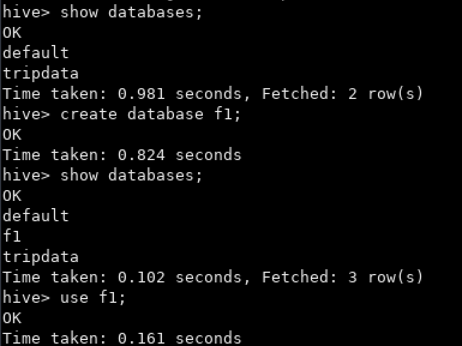

A. `driver_results` (driver_forename, driver_surname, driver_nationality, points)

```
CREATE EXTERNAL TABLE f1.driver_results(driver_forename STRING, driver_surname STRING, driver_nationality STRING, points DOUBLE)
COMMENT 'F1 Driver Results table'
ROW FORMAT DELIMITED
FIELDS TERMINATED BY ','
LOCATION '/tables/external/f1/driver_results';
```

B. `constructor_results` (constructorRef, cons_name, cons_nationality, url, points)

```
CREATE EXTERNAL TABLE f1.constructor_results(constructorRef STRING, cons_name STRING, cons_nationality STRING, url STRING, points DOUBLE)
COMMENT 'F1 Constructor Results table'
ROW FORMAT DELIMITED
FIELDS TERMINATED BY ','
LOCATION '/tables/external/f1/constructor_results';
```

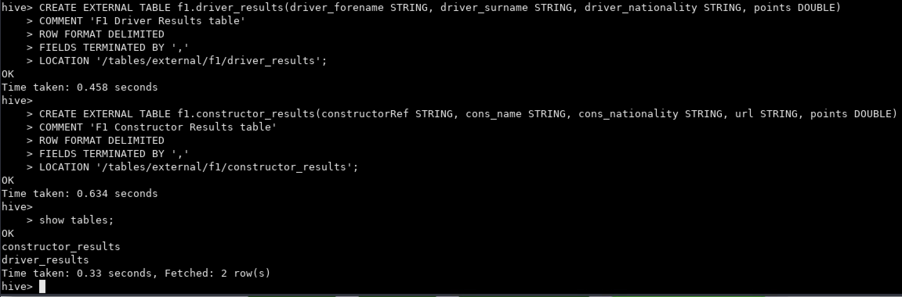


### Ejercicio 2

En Hive, mostrar el esquema de `driver_results` y `constructor_results`.

```
describe driver_results;

describe constructor_results;
```

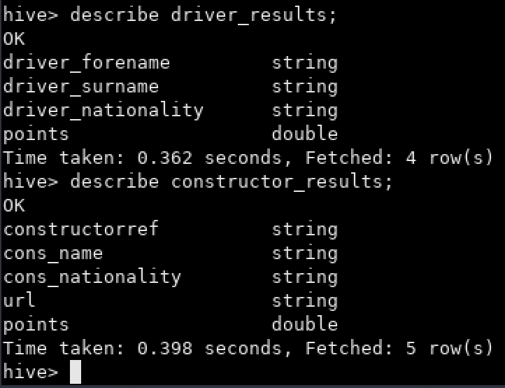


### Ejercicio 3

Crear un archivo `.bash` que permita descargar los archivos mencionados abajo e ingestarlos en HDFS:
* [results.csv](https://data-engineer-edvai.s3.amazonaws.com/f1/results.csv)
* [drivers.csv](https://data-engineer-edvai.s3.amazonaws.com/f1/drivers.csv)
* [constructors.csv](https://data-engineer-edvai.s3.amazonaws.com/f1/constructors.csv)
* [races.csv](https://data-engineer-edvai.s3.amazonaws.com/f1/races.csv)

```bash
# Remove old tripdata files
rm -rf /home/hadoop/landing/results.csv
rm -rf /home/hadoop/landing/drivers.csv
rm -rf /home/hadoop/landing/constructors.csv
rm -rf /home/hadoop/landing/races.csv

# Download F1 file into /home/hadoop/landing
wget -P /home/hadoop/landing https://data-engineer-edvai.s3.amazonaws.com/f1/results.csv
wget -P /home/hadoop/landing https://data-engineer-edvai.s3.amazonaws.com/f1/drivers.csv
wget -P /home/hadoop/landing https://data-engineer-edvai.s3.amazonaws.com/f1/constructors.csv
wget -P /home/hadoop/landing https://data-engineer-edvai.s3.amazonaws.com/f1/races.csv

# Remove old tripdata files in HDFS
/home/hadoop/hadoop/bin/hdfs dfs -rm -f /ingest/results.csv
/home/hadoop/hadoop/bin/hdfs dfs -rm -f /ingest/drivers.csv
/home/hadoop/hadoop/bin/hdfs dfs -rm -f /ingest/constructors.csv
/home/hadoop/hadoop/bin/hdfs dfs -rm -f /ingest/races.csv

# Insert tripdata files into HDFS
/home/hadoop/hadoop/bin/hdfs dfs -put /home/hadoop/landing/results.csv /ingest
/home/hadoop/hadoop/bin/hdfs dfs -put /home/hadoop/landing/drivers.csv /ingest
/home/hadoop/hadoop/bin/hdfs dfs -put /home/hadoop/landing/constructors.csv /ingest
/home/hadoop/hadoop/bin/hdfs dfs -put /home/hadoop/landing/races.csv /ingest
```

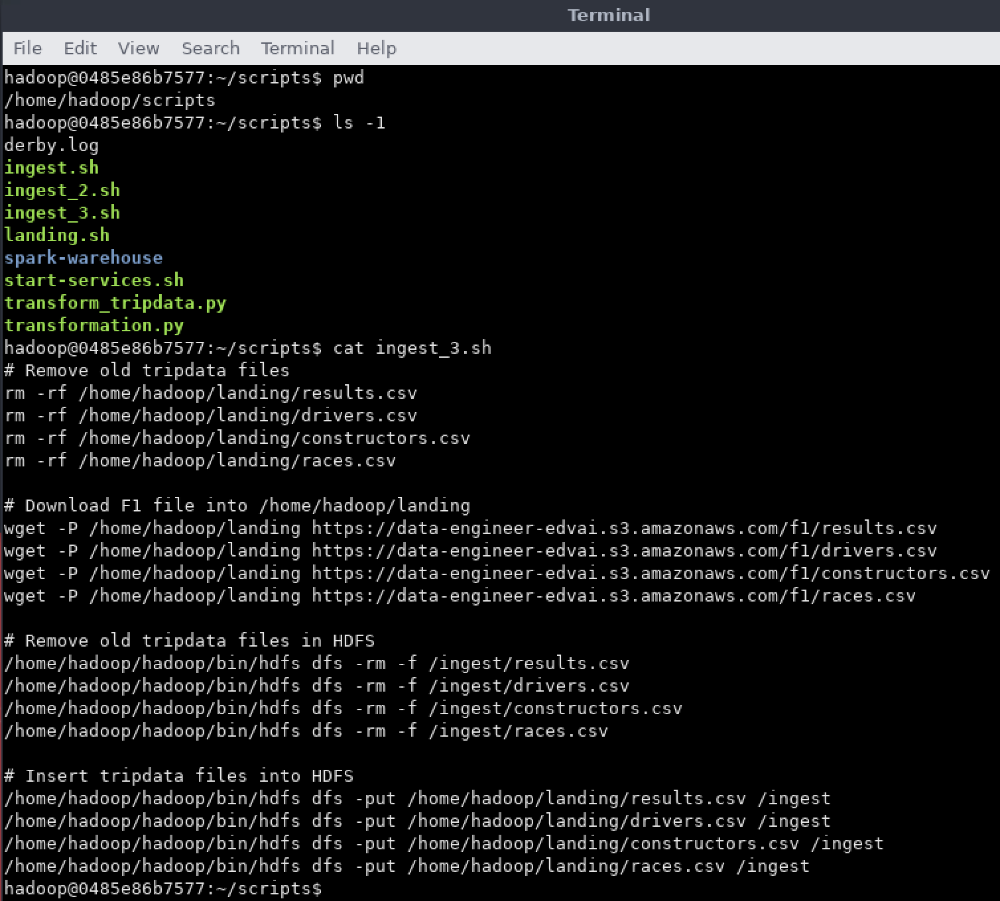

* Ubicación del archivo: `/home/hadoop/scripts`
* Cambiar permisos del archivo con: `chmod 777 ingest_3.sh`


### Ejercicio 4

Generar un archivo `.py` que permita, mediante Spark:
A. Insertar en la tabla `driver_results` los corredores con mayor cantidad de puntos en la historia.
B. Insertar en la tabla `constructor_result` quienes obtuvieron más puntos en el Spanish Grand Prix en el año 1991.

* Archivos creado: `transform_f1_constructor.py` y `transform_f1_driver.py`
* Ubicación del archivo: `/home/hadoop/scripts`
* Cambiar permisos del archivo con: `chmod 777 transform_f1_constructor.py` y `chmod 777 transform_f1_driver.py`

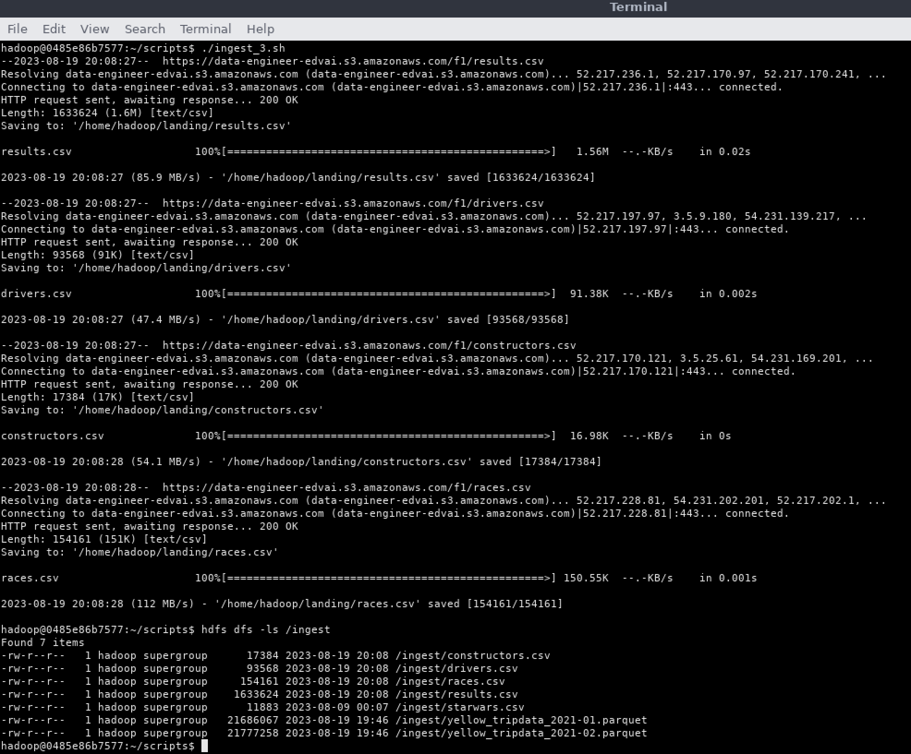

### Ejercicio 5

Realizar un proceso automático en Airflow que orqueste los archivos creados en los puntos 3 y 4.  
Correrlo y mostrar una captura de pantalla (del DAG y del resultado en la base de datos).

* Archivo creado: `exercise_class_8_dag.py`
* Ubicación del archivo: `/home/hadoop/airflow/dags`

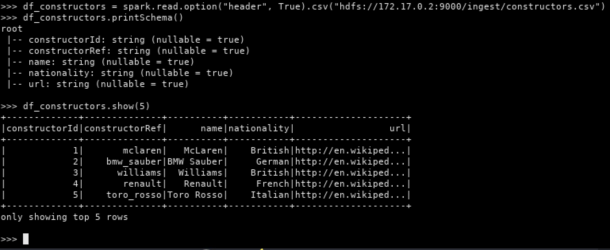

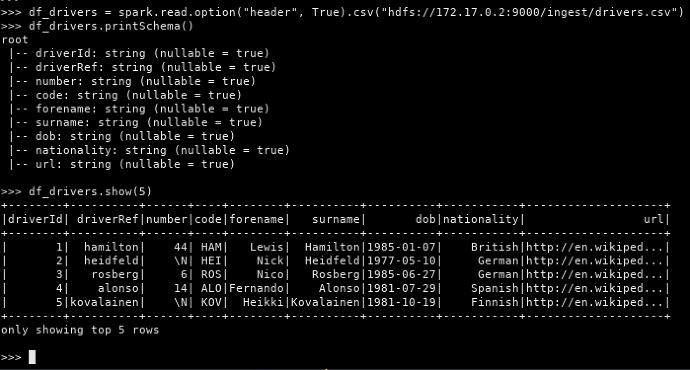

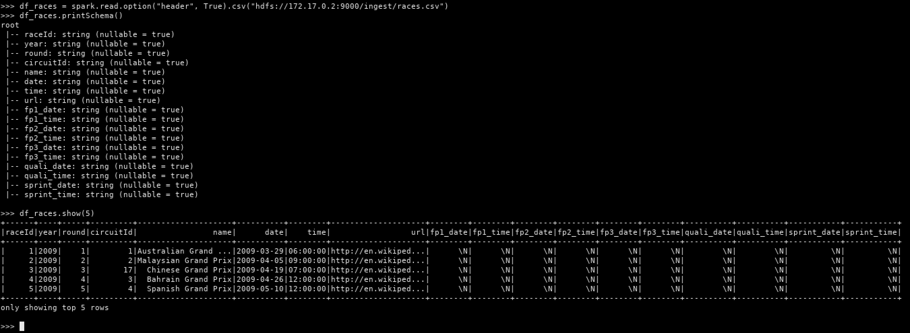

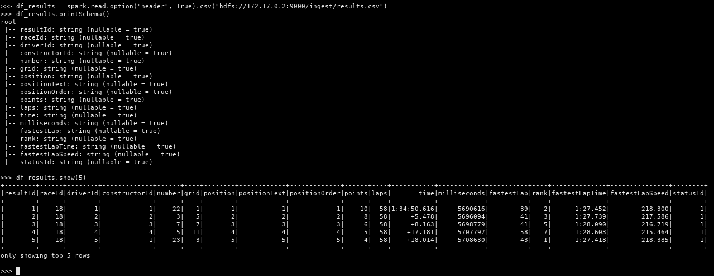

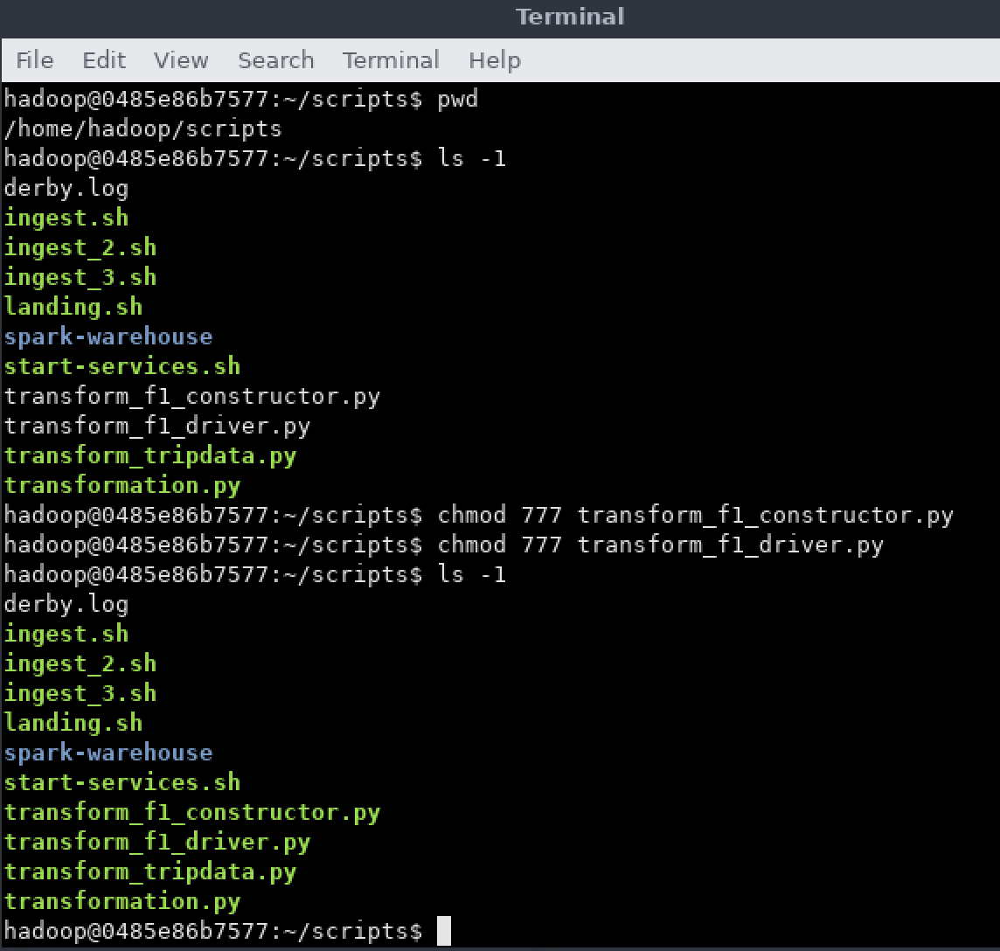

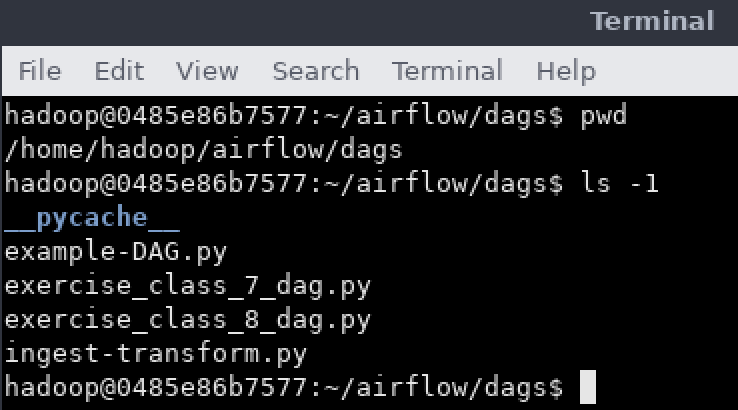

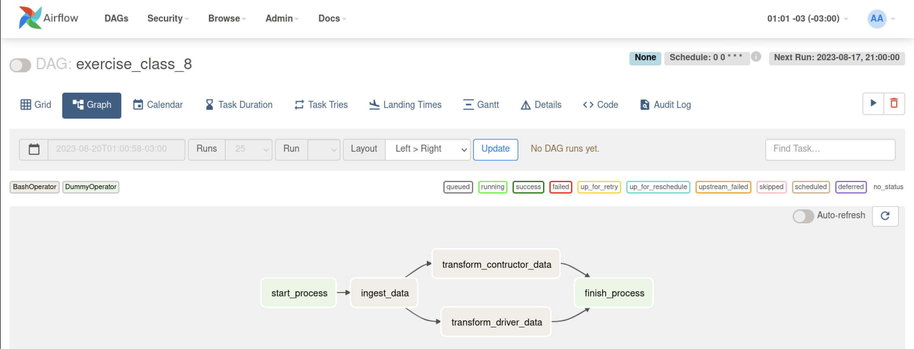

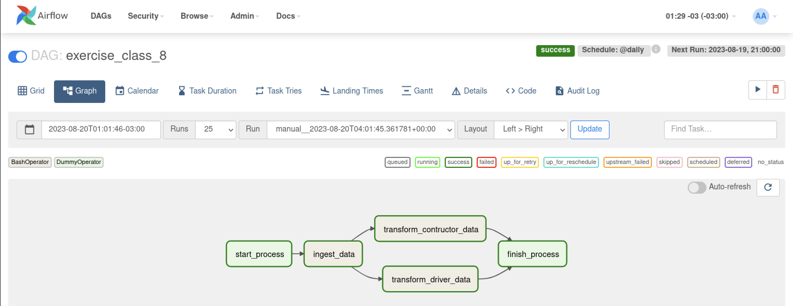

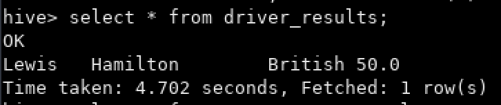

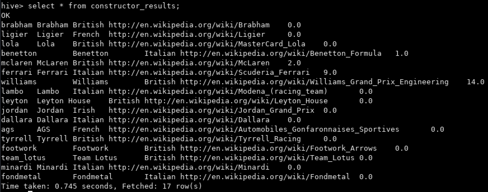
