Clase 09 - Sqoop y Airflow
==========================

### Ejercicio 1

Crear una base de datos en Hive llamada `northwind_analytics`.

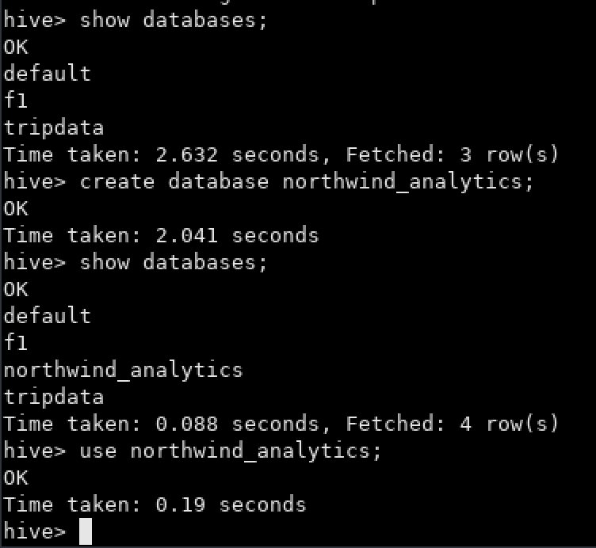

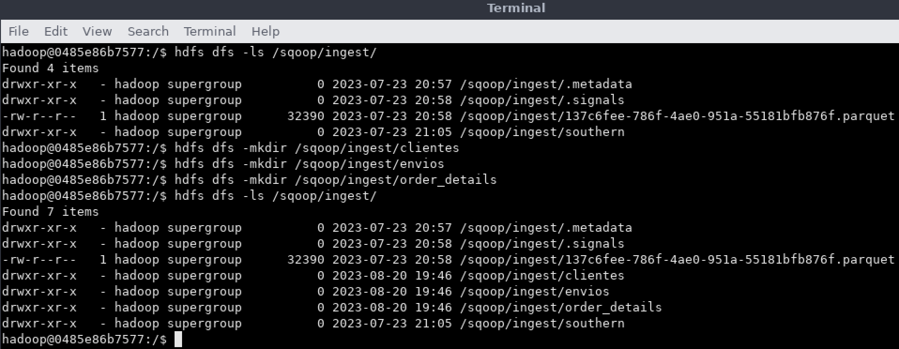

### Ejercicio 2

Crear un script para importar un archivo `.parquet` de la base northwind que contenga la lista de clientes junto a la cantidad de productos vendidos ordenados de mayor a menor (campos: customer_id, company_name, productos_vendidos).  
Luego ingestar el archivo a HDFS (carpeta `/sqoop/ingest/clientes`).  
Pasar la password en un archivo.

```sql
select
    c.customer_id,
    c.company_name,
    sum(od.quantity) as productos_vendidos
from
    orders o
    inner join order_details od on o.order_id = od.order_id
    left join customers c on o.customer_id = c.customer_id
group by
    c.customer_id, c.company_name
order by
    sum(od.quantity) desc;
```

```bash
sqoop import \
--connect jdbc:postgresql://172.17.0.3:5432/northwind \
--username postgres \
--P \
--query "select c.customer_id, c.company_name, sum(od.quantity) as productos_vendidos from orders o inner join order_details od on o.order_id = od.order_id left join customers c on o.customer_id = c.customer_id where \$CONDITIONS group by c.customer_id, c.company_name order by sum(od.quantity) desc" \
--m 1 \
--target-dir /sqoop/ingest/clientes \
--as-parquetfile \
--delete-target-dir
```

* Ubicación del archivo: `/home/hadoop/scripts`
* Cambiar permisos del archivo con: `chmod 777 ingest_na_clientes.sh`


### Ejercicio 3

Crear un script para importar un archivo `.parquet` de la base northwind que contenga la lista de órdenes junto a qué empresa realizó cada pedido (campos: order_id,
shipped_date, company_name, phone).  
Luego ingestar el archivo a HDFS (carpeta `/sqoop/ingest/envios`).  
Pasar la password en un archivo.

```sql
select
    o.order_id,
    cast(o.shipped_date as varchar),
    c.company_name,
    c.phone
from
    orders o
    left join customers c on o.customer_id = c.customer_id;
```

```bash
sqoop import \
--connect jdbc:postgresql://172.17.0.3:5432/northwind \
--username postgres \
--P \
--query "select o.order_id, cast(o.shipped_date as varchar), c.company_name, c.phone from orders o left join customers c on o.customer_id = c.customer_id where \$CONDITIONS" \
--m 1 \
--target-dir /sqoop/ingest/envios \
--as-parquetfile \
--delete-target-dir
```

* Ubicación del archivo: `/home/hadoop/scripts`
* Cambiar permisos del archivo con: `chmod 777 ingest_na_envios.sh`


### Ejercicio 4

Crear un script para importar un archivo `.parquet` de la base northwind que contenga la lista de detalles de órdenes (campos: order_id, unit_price, quantity, discount).  
Luego ingestar el archivo a HDFS (carpeta `/sqoop/ingest/order_details`).  
Pasar la password en un archivo.

```sql
select
    od.order_id,
    od.unit_price,
    od.quantity,
    od.discount
from
    order_details od;
```

```bash
sqoop import \
--connect jdbc:postgresql://172.17.0.3:5432/northwind \
--username postgres \
--P \
--query "select od.order_id, od.unit_price, od.quantity, od.discount from order_details od where \$CONDITIONS" \
--m 1 \
--target-dir /sqoop/ingest/order_details \
--as-parquetfile \
--delete-target-dir
```

* Ubicación del archivo: `/home/hadoop/scripts`
* Cambiar permisos del archivo con: `chmod 777 ingest_na_od.sh`


### Ejercicio 5

Generar un archivo `.py` que permita mediante Spark insertar en Hive en la DB `northwind_analytics` en la tabla `products_sold`, los datos del punto 2, pero solamente aquellas compañías en las que la cantidad de productos vendidos fue mayor al promedio.

```
CREATE EXTERNAL TABLE northwind_analytics.products_sold(customer_id STRING, company_name STRING, productos_vendidos INTEGER)
COMMENT 'Northwind Analytics Products Sold table'
ROW FORMAT DELIMITED
FIELDS TERMINATED BY ','
LOCATION '/tables/external/northwind_analytics/products_sold';
```

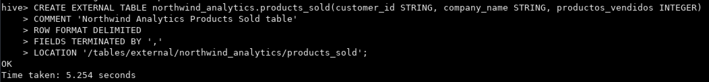

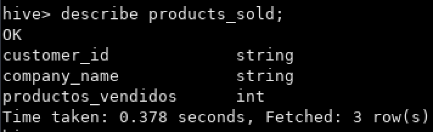

* Archivos creado: `transform_na_prod_sold.py`
* Ubicación del archivo: `/home/hadoop/scripts`
* Cambiar permisos del archivo con: `chmod 777 transform_na_prod_sold.py`


### Ejercicio 6

Generar un archivo `.py` que permita mediante Spark insertar en Hive en la DB `northwind_analytics` en la tabla `products_sent`, los datos del punto 3 y 4, de manera tal que se vean las columnas order_id, shipped_date, company_name, phone, unit_price_discount (unit_price with discount), quantity, total_price (unit_price_discount * quantity).  
Solo de aquellos pedidos que hayan tenido descuento.

```
CREATE EXTERNAL TABLE northwind_analytics.products_sent(order_id INTEGER, shipped_date DATE, company_name STRING, phone STRING, unit_price_discount DOUBLE, quantity INTEGER, total_price DOUBLE)
COMMENT 'Northwind Analytics Products Sent table'
ROW FORMAT DELIMITED
FIELDS TERMINATED BY ','
LOCATION '/tables/external/northwind_analytics/products_sent';
```

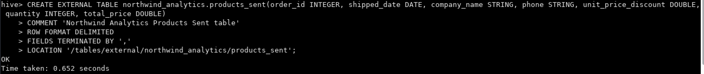

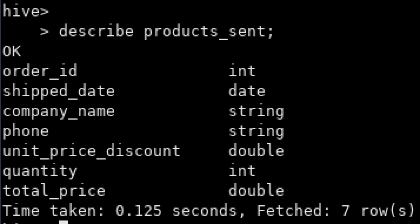

* Archivos creado: `transform_na_prod_send.py`
* Ubicación del archivo: `/home/hadoop/scripts`
* Cambiar permisos del archivo con: `chmod 777 transform_na_prod_send.py`


### Ejercicio 7

Realizar un proceso automático en Airflow que orqueste los pipelines creados en los puntos anteriores.  
Crear un grupo para la etapa de ingest y otro para la etapa de process.  
Correrlo y mostrar una captura de pantalla (del DAG y del resultado en la base de datos).

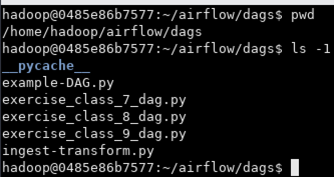

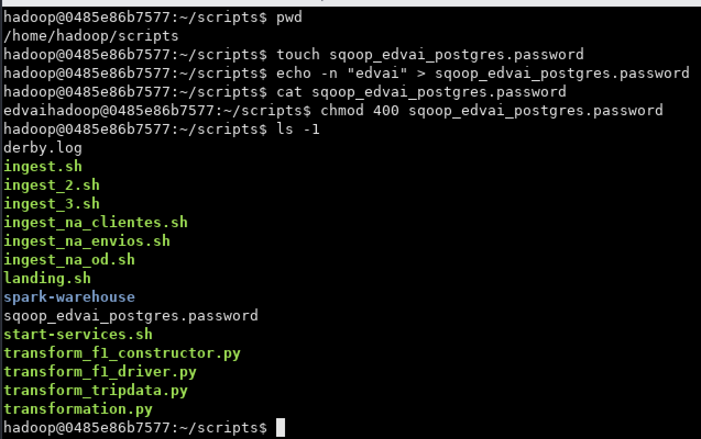

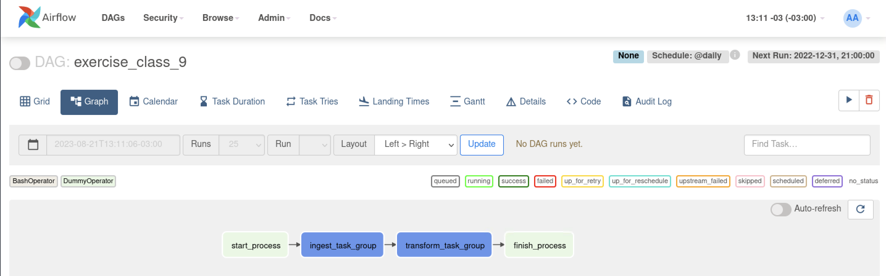

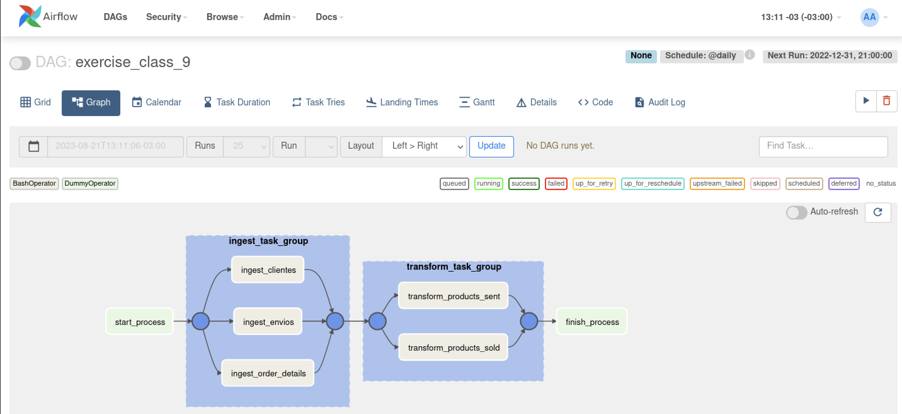

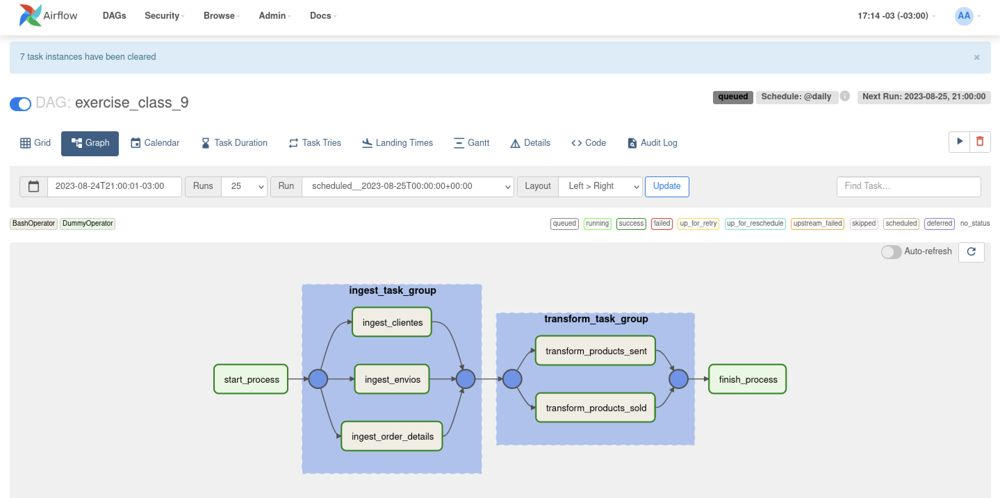

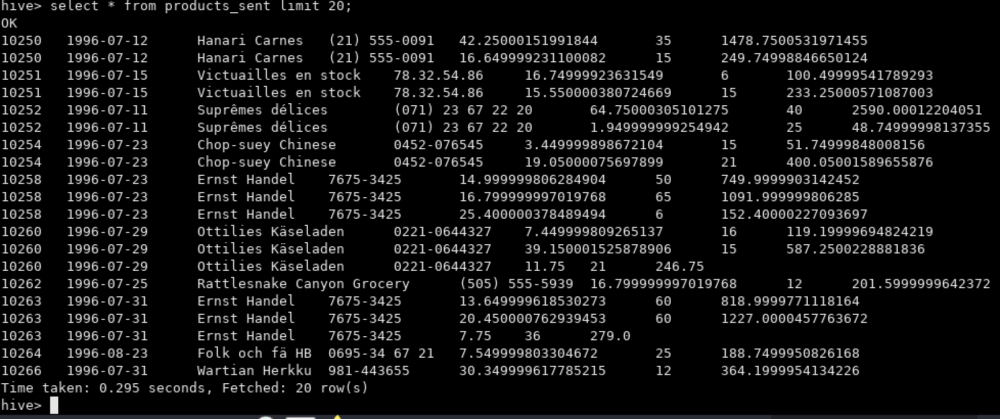

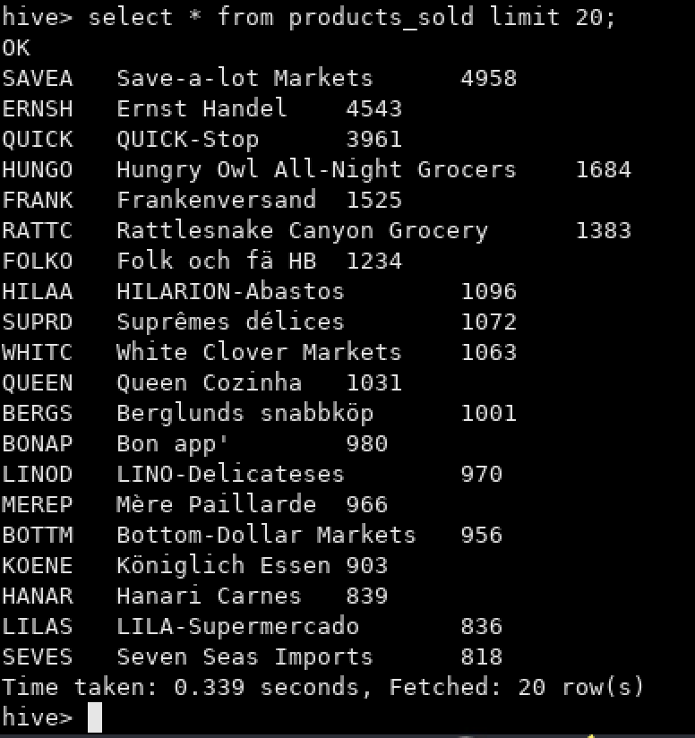
