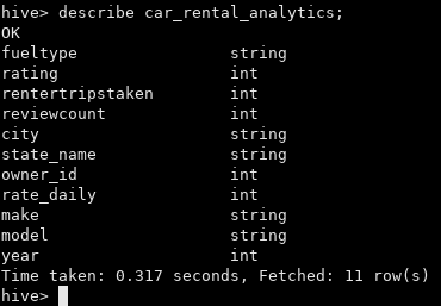

Alquiler de automóviles
=======================

Una de las empresas líderes en alquileres de automóviles solicita una serie de dashboards y reportes para poder basar sus decisiones en datos. Entre los indicadores mencionados se encuentran total de alquileres, segmentación por tipo de combustible, lugar, marca y modelo de automóvil, valoración de cada alquiler, etc.

Como Data Engineer debe crear y automatizar el pipeline para tener como resultado los datos listos para ser visualizados y responder las preguntas de negocio.

#### Tarea 1

Crear en hive una database `car_rental_db` y dentro una tabla llamada `car_rental_analytics`, con estos campos:

| **campos**       | **tipo** |
|------------------|----------|
| fuelType         | string   |
| rating           | integer  |
| renterTripsTaken | integer  |
| reviewCount      | integer  |
| city             | string   |
| state_name       | string   |
| owner_id         | integer  |
| rate_daily       | integer  |
| make             | string   |
| model            | string   |
| year             | integer  |

```
show databases;
create database car_rental_db;
show databases;
use car_rental_db;
```


```
CREATE EXTERNAL TABLE car_rental_db.car_rental_analytics(fuelType STRING, rating INTEGER, renterTripsTaken INTEGER, reviewCount INTEGER, city STRING, state_name STRING, owner_id INTEGER, rate_daily INTEGER, make STRING, model STRING, year INTEGER)
COMMENT 'Car Rental_db DB - Car Rental Analytics'
ROW FORMAT DELIMITED
FIELDS TERMINATED BY ','
LOCATION '/tables/external/car_rental_db/car_rental_analytics';
```


```
describe car_rental_analytics;
```



#### Tarea 2

Crear script para el ingest de estos dos files:
* https://data-engineer-edvai.s3.amazonaws.com/CarRentalData.csv
* https://public.opendatasoft.com/api/explore/v2.1/catalog/datasets/georef-united-states-of-america-state/exports/csv?lang=en&timezone=America%2FArgentina%2FBuenos_Aires&use_labels=true&delimiter=%3B

**Sugerencia**: Descargar el segundo archivo con un comando similar al abajo mencionado, ya que al tener caracteres como `&` falla si no se le asignan comillas. Adicionalmente, el parámetro `-O` permite asignarle un nombre más legible al archivo descargado

```bash
wget -P ruta_destino -O ruta_destino/nombre_archivo.csv ruta_al_archivo
```


> Creamos el directorio en HDFS y le damos los permisos:

```
hdfs dfs -mkdir /car_rental
hdfs dfs -chmod 777 /car_rental
```


> * Ver contenido del archivo: `ingest_car_rental.sh`
> * Ubicación del archivo: `/home/hadoop/scripts/car_rental`
> * Cambiar permisos del archivo con: `chmod 777 ingest_car_rental.sh`

#### Tarea 3

Crear un script para tomar el archivo desde HDFS y hacer las siguientes transformaciones:
* En donde sea necesario, modificar los nombres de las columnas. Evitar espacios y puntos (reemplazar por _ ). Evitar nombres de columna largos.
* Redondear los float de ‘rating’ y castear a int.
* Joinear ambos files
* Eliminar los registros con rating nulo
* Cambiar mayúsculas por minúsculas en ‘fuelType’
* Excluir el estado Texas

Finalmente insertar en Hive el resultado.

> Ver contenido del archivo `transform_car_rental.py`

#### Tarea 4

Realizar un proceso automático en Airflow que orqueste los pipelines creados en los puntos anteriores. Crear dos tareas:
A. Un DAG padre que ingente los archivos y luego llame al DAG hijo
B. Un DAG hijo que procese la información y la cargue en Hive

> * Ver contenido del archivo: `car_rental_dag.py`
> * Ubicación del archivo: `/home/hadoop/airflow/dags`


#### Tarea 5

Por medio de consultas SQL al data-warehouse, mostrar:
  1. Cantidad de alquileres de autos, teniendo en cuenta sólo los vehículos ecológicos (fuelType hibrido o eléctrico) y con un rating de al menos 4.

```sql
select
    count(*)
from
    car_rental_analytics
where
    ((fueltype == 'electric') or (fueltype == 'hybrid')) and (rating >= 4);
```


  2. Los 5 estados con menor cantidad de alquileres (crear visualización)

```sql
select
    state_name,
    count(*) as number_rentals
from
    car_rental_analytics
group by
    state_name
order by
    number_rentals asc
limit
    5;
```


  3. Los 10 modelos (junto con su marca) de autos más rentados (crear visualización)

```sql
select
    make,
    model,
    count(*) as number_rentals
from
    car_rental_analytics
group by
    make,
    model
order by
    number_rentals desc
limit
    10;
```


  4. Mostrar por año, cuántos alquileres se hicieron, teniendo en cuenta automóviles fabricados desde 2010 a 2015

```sql
select
    year,
    count(*) as number_rentals
from
    car_rental_analytics
where
    (year >= 2010) and (year <= 2015)
group by
    year
order by
    year asc;
```


  5. Las 5 ciudades con más alquileres de vehículos ecológicos (fuelType hibrido o electrico)

```sql
select
    city,
    count(*) as number_rentals
from
    car_rental_analytics
where
    (fueltype == 'electric') or (fueltype == 'hybrid')
group by
    city
order by
    number_rentals desc
limit
    5;
```


  6. El promedio de reviews, segmentando por tipo de combustible

```sql
select
    fueltype,
    avg(reviewcount) as review_count_avg
from
    car_rental_analytics
group by
    fueltype
order by
    review_count_avg desc;
```


#### Tarea 6

Elabore sus conclusiones y recomendaciones sobre este proyecto.

> Como los autos ecológicos (híbridos y eléctricos) son en porcentajes los que más reseñas tienen y siendo los Tesla (autos ecológicos) los autos más elegidos a la hora de alquilar, deberían aumentarse la flota de estos autos para aumentar en las ciudades de San Jose, Phoenix y Portland los alquileres de vehículos, ya que estas ciudades tienen el menor número de alquileres de autos ecológicos.  
> Además la compañía debería aumentar la disponibilidad de vehículos en Montana para aumentar el número de alquileres en ese estado, ya que dicho estado es el que menos alquileres tiene.

#### Tarea 7

Proponer una arquitectura alternativa para este proceso ya sea con herramientas on premise o cloud (Si aplica).


> Por un lado insertamos los datos provenientes de bases de datos o algún bucket de AWS a un Cloud Storage usando Data Fusion orquestándolo con Cloud Composer. Adicional se le podría sumar una fuente que contenga los datos del los vehículos, como por ejemplo el consumo promedio de combustible, velocidad, aceleración, etc.  
> Luego con Dataproc procesamos esa información y la almacenamos en BigQuery para su posterior visualización usando Looker Studio.
