Aviación Civil
==============

La Administración Nacional de Aviación Civil necesita una serie de informes para elevar al ministerio de transporte acerca de los aterrizajes y despegues en todo el territorio Argentino, como puede ser: cuales aviones son los que más volaron, cuántos pasajeros volaron, ciudades de partidas y aterrizajes entre fechas determinadas, etc.

Usted como data engineer deberá realizar un pipeline con esta información, automatizarlo y realizar los análisis de datos solicitados que permita responder las preguntas de negocio, y hacer sus recomendaciones con respecto al estado actual.

* [Listado de vuelos realizados](https://datos.transporte.gob.ar/dataset/aterrizajes-y-despegues-procesados-por-la-administracion-nacional-de-aviacion-civil-anac):
* [Listado de detalles de aeropuertos de Argentina](https://datos.transporte.gob.ar/dataset/lista-aeropuertos)

#### Tarea 1

Hacer ingest de los siguientes files relacionados con transporte aéreo de Argentina:
* [2021-informe-ministerio.csv](https://data-engineer-edvai.s3.amazonaws.com/2021-informe-ministerio.csv)
* [202206-informe-ministerio.csv](https://data-engineer-edvai.s3.amazonaws.com/202206-informe-ministerio.csv)
* [aeropuertos_detalle.csv](https://data-engineer-edvai.s3.amazonaws.com/aeropuertos_detalle.csv)

> Creamos el directorio en HDFS y le damos los permisos:

```
hdfs dfs -mkdir /civil_aviation
hdfs dfs -chmod 777 /civil_aviation
```

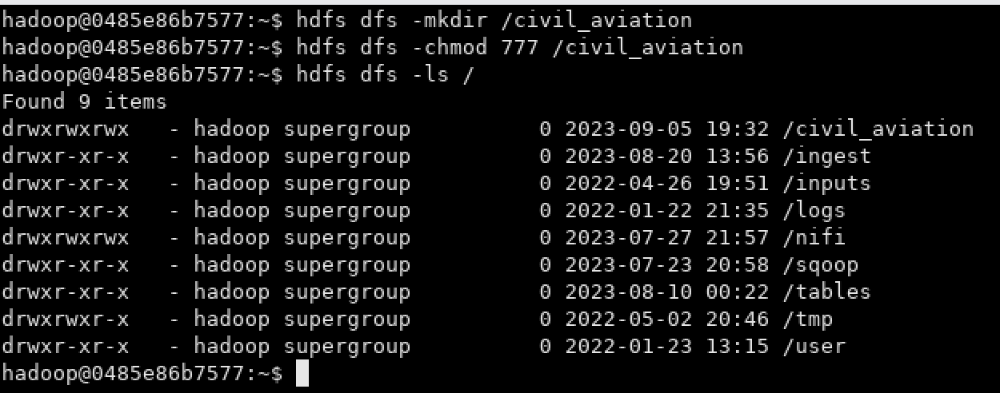

#### Tarea 2

Crear 2 tablas en el datawarehouse, una `aeropuerto_tabla` para los vuelos realizados en 2021 y 2022 (**2021-informe-ministerio.csv** y **202206-informe-ministerio.csv**) y otra tabla `aeropuerto_detalles_tabla` para el detalle de los aeropuertos (**aeropuertos_detalle.csv**).

```
show databases;
create database aeropuerto;
show databases;
use aeropuerto;
```

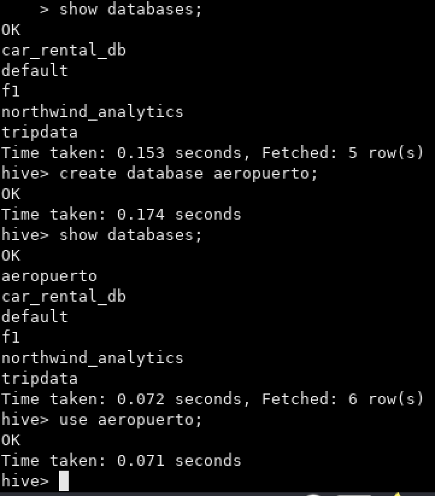

**Schema Tabla 1**

| **campos**             | **tipo** |
|------------------------|----------|
| fecha                  | date     |
| horaUTC                | string   |
| clase_de_vuelo         | string   |
| clasificacion_de_vuelo | string   |
| tipo_de_movimiento     | string   |
| aeropuerto             | string   |
| origen_destino         | string   |
| aerolinea_nombre       | string   |
| aeronave               | string   |
| pasajeros              | integer  |

```
CREATE EXTERNAL TABLE aeropuerto.aeropuerto_tabla(fecha DATE, horaUTC STRING, clase_de_vuelo STRING, clasificacion_de_vuelo STRING, tipo_de_movimiento STRING, aeropuerto STRING, origen_destino STRING, aerolinea_nombre STRING, aeronave STRING, pasajeros INTEGER)
COMMENT 'Aeropuerto DB - Aeropuerto Tabla'
ROW FORMAT DELIMITED
FIELDS TERMINATED BY ','
LOCATION '/tables/external/aeropuerto/aeropuerto_tabla';
```

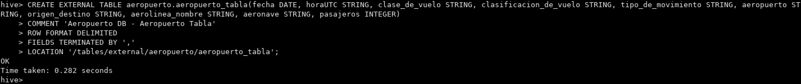

**Schema Tabla 2**

| **campos**    | **tipo** |
|---------------|----------|
| aeropuerto    | string   |
| oac           | string   |
| iata          | string   |
| tipo          | string   |
| denominacion  | string   |
| coordenadas   | string   |
| latitud       | string   |
| longitud      | string   |
| elev          | string   |
| uom_elev      | string   |
| ref           | string   |
| distancia_ref | float    |
| direccion_ref | string   |
| condicion     | string   |
| control       | string   |
| region        | string   |
| uso           | string   |
| trafico       | string   |
| sna           | string   |
| concesionado  | string   |
| provincia     | string   |

```
CREATE EXTERNAL TABLE aeropuerto.aeropuerto_detalles_tabla(aeropuerto STRING, oac STRING, iata STRING, tipo STRING, denominacion STRING, coordenadas STRING, latitud STRING, longitud STRING, elev STRING, uom_elev STRING, ref STRING, distancia_ref DOUBLE, direccion_ref STRING, condicion STRING, control STRING, region STRING, uso STRING, trafico STRING, sna STRING, concesionado STRING, provincia STRING)
COMMENT 'Aeropuerto DB - Aeropuerto Detalle Tabla'
ROW FORMAT DELIMITED
FIELDS TERMINATED BY ','
LOCATION '/tables/external/aeropuerto/aeropuerto_detalles_tabla';
```

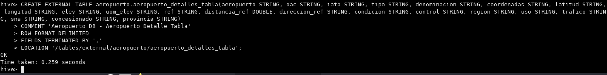

#### Tarea 3

Realizar un proceso automático orquestado por airflow que ingeste los archivos previamente mencionados entre las fechas 01/01/2021 y 30/06/2022 en las dos columnas creadas:
* Los archivos **2021-informe-ministerio.csv** y **202206-informe-ministerio.csv** &rarr; en la tabla `aeropuerto_tabla`
* El archivo **aeropuertos_detalle.cs**v &rarr; en la tabla `aeropuerto_detalles_tabla`

> * Ver contenido del archivo: `ingest_civil_aviation.sh`
> * Ubicación del archivo: `/home/hadoop/scripts/civil_aviation`
> * Cambiar permisos del archivo con: `chmod 777 ingest_civil_aviation.sh`

> * Ver contenido del archivo: `civil_aviation_dag.py`
> * Ubicación del archivo: `/home/hadoop/airflow/dags`

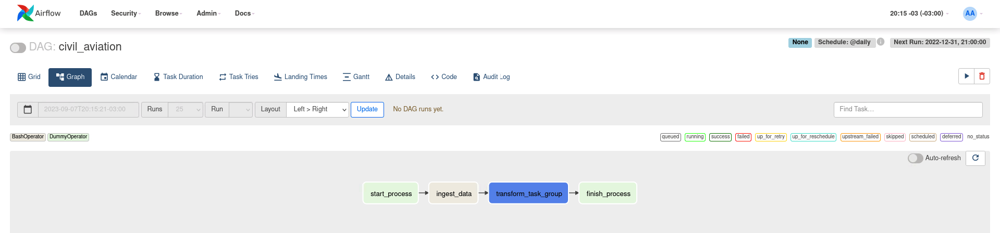

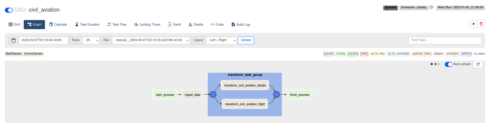

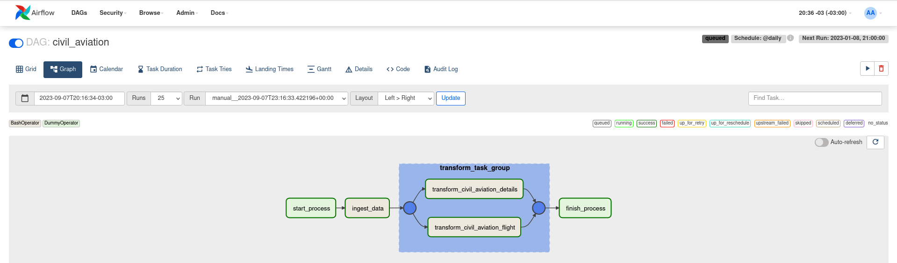

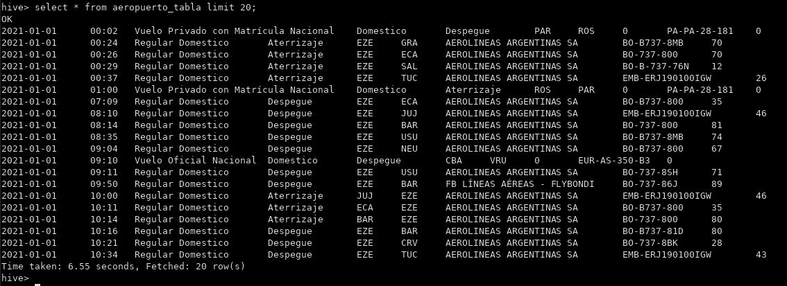

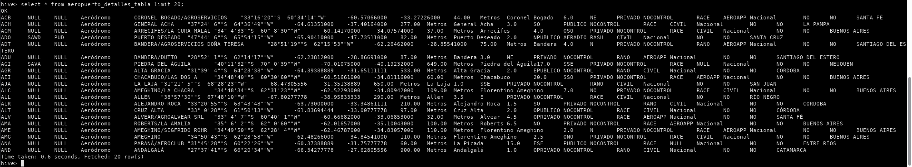

#### Tarea 4

Realizar las siguiente transformaciones en los pipelines de datos:
* Eliminar la columna inhab ya que no se utilizará para el análisis
* Eliminar la columna fir ya que no se utilizará para el análisis
* Eliminar la columna "calidad del dato" ya que no se utilizará para el análisis
* Filtrar los vuelos internacionales ya que solamente se analizarán los vuelos domésticos
* En el campo pasajeros si se encuentran campos en Null convertirlos en 0 (cero)
* En el campo distancia_ref si se encuentran campos en Null convertirlos en 0 (cero)

> Ver contenido de los archivos:
>   * `transform_civil_aviation_flights.py`
>   * `transform_civil_aviation_details.py`

#### Tarea 5

Mostrar mediante una impresión de pantalla, que los tipos de campos de las tablas sean los solicitados en el datawarehouse (ej: fecha date, aeronave string, pasajeros integer, etc.).

```
describe aeropuerto_tabla;
```

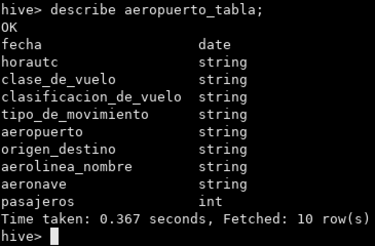

```
describe aeropuerto_detalles_tabla;
```

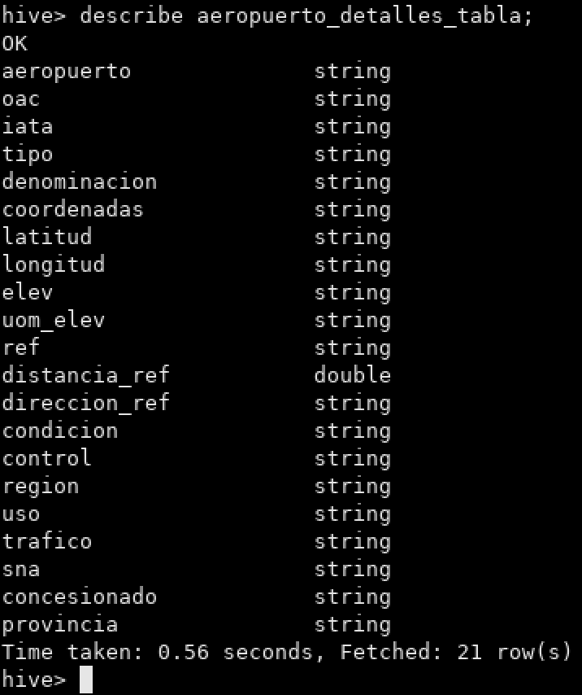

#### Tarea 6

Determinar la cantidad de vuelos entre las fechas 01/12/2021 y 31/01/2022. Mostrar consulta y Resultado de la query.

```sql
select
    count(*)
from
    aeropuerto_tabla
where
    (fecha >= '2021-12-01') and (fecha <= '2022-01-31');
```

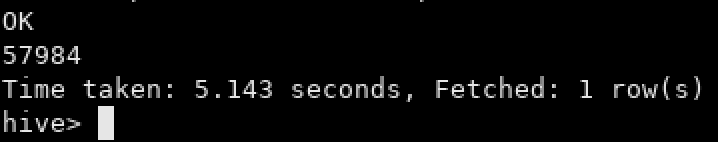

#### Tarea 7

Cantidad de pasajeros que viajaron en Aerolíneas Argentinas entre el 01/01/2021 y 30/06/2022. Mostrar consulta y Resultado de la query.

```sql
select
    count(*)
from
    aeropuerto_tabla
where
    (aerolinea_nombre = 'AEROLINEAS ARGENTINAS SA')
    and (fecha >= '2021-01-01') and (fecha <= '2022-06-30');
```

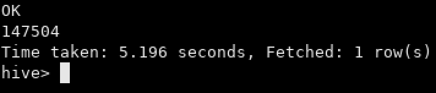

#### Tarea 8

Mostrar fecha, hora, código aeropuerto salida, ciudad de salida, código de aeropuerto de arribo, ciudad de arribo, y cantidad de pasajeros de cada vuelo, entre el 01/01/2022 y el 30/06/2022 ordenados por fecha de manera descendiente. Mostrar consulta y resultado de la query.

```sql
select
    fecha_salida,
    horautc_salida,
    aeropuerto_salida,
    origen,
    fecha_arribo,
    horautc_arribo,
    aeropuerto_arribo,
    destino,
    pasajeros_arribo as pasajeros
from
    (
        select
            fecha as fecha_salida, horautc as horautc_salida, aeropuerto as aeropuerto_salida, origen_destino as origen, aerolinea_nombre as aerolinea_nombre_salida, aeronave as aeronave_salida, pasajeros as pasajeros_salida
        from
            aeropuerto_tabla
        where
            tipo_de_movimiento = 'Despegue'
    ) as d1 inner join (
        select
            fecha as fecha_arribo, horautc as horautc_arribo, aeropuerto as aeropuerto_arribo, origen_destino as destino, aerolinea_nombre as aerolinea_nombre_arribo, aeronave as aeronave_arribo, pasajeros as pasajeros_arribo
        from
            aeropuerto_tabla
        where
            tipo_de_movimiento = 'Aterrizaje'
    )  as d2 on (d1.aerolinea_nombre_salida = d2.aerolinea_nombre_arribo) and (d1.aeronave_salida = d2.aeronave_arribo) and (d1.pasajeros_salida = d2.pasajeros_arribo)
where
    (fecha_salida <= fecha_arribo)
    and (aeropuerto_salida != aeropuerto_arribo)
order by
    fecha_salida, fecha_arribo, horautc_salida, horautc_arribo desc
```

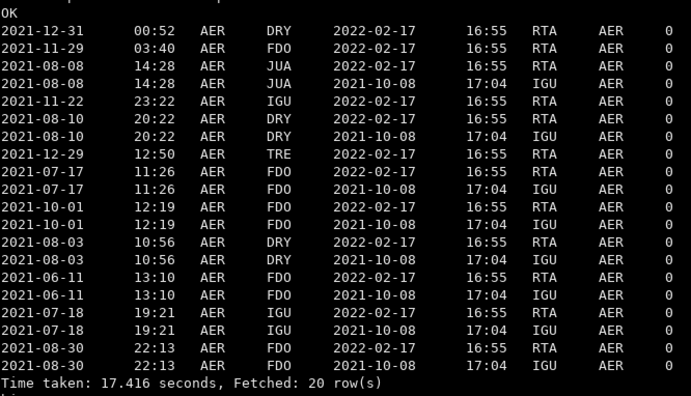

#### Tarea 9

Cuales son las 10 aerolíneas que más pasajeros llevaron entre el 01/01/2021 y el 30/06/2022 exceptuando aquellas aerolíneas que no tengan nombre. Mostrar consulta y visualización.

```sql
select
    aerolinea_nombre,
    sum(pasajeros) as quantity_pasajeros
from
    aeropuerto_tabla
where
    (aerolinea_nombre != '0')
    and (fecha >= '2021-01-01') and (fecha <= '2022-06-30')
group by
    aerolinea_nombre
order by
    quantity_pasajeros desc
limit
    10;
```

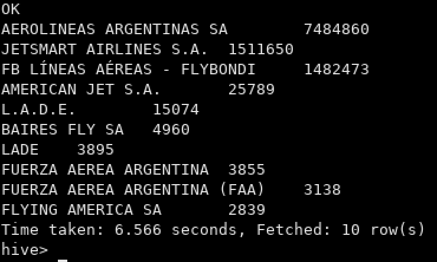

#### Tarea 10

Cuales son las 10 aeronaves más utilizadas entre el 01/01/2021 y el 30/06/2022 que despegaron desde la Ciudad autónoma de Buenos Aires o de Buenos Aires, exceptuando aquellas aeronaves que no cuentan con nombre. Mostrar consulta y visualización.

```sql
select
    aeronave,
    count(*) as number_uses
from
    aeropuerto_tabla aerotbl
    inner join aeropuerto_detalles_tabla aerodettbl on (aerotbl.aeropuerto = aerodettbl.aeropuerto)
where
    (aerotbl.aeronave != '0')
    and ((aerotbl.fecha >= '2021-01-01') and (aerotbl.fecha <= '2022-06-30'))
    and ((aerodettbl.provincia = 'CIUDAD AUTÓNOMA DE BUENOS AIRES') or (aerodettbl.provincia = 'BUENOS AIRES'))
group by
    aeronave
order by
    number_uses desc
limit
    10;
```

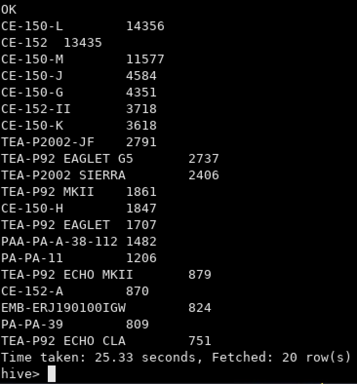

#### Tarea 11

Qué datos externos agregaría en este dataset que mejoraría el análisis de los datos.

#### Tarea 12

Elabore sus conclusiones y recomendaciones sobre este proyecto.

#### Tarea 13

Proponer una arquitectura alternativa para este proceso ya sea con herramientas on premise o cloud (Sí aplica).
